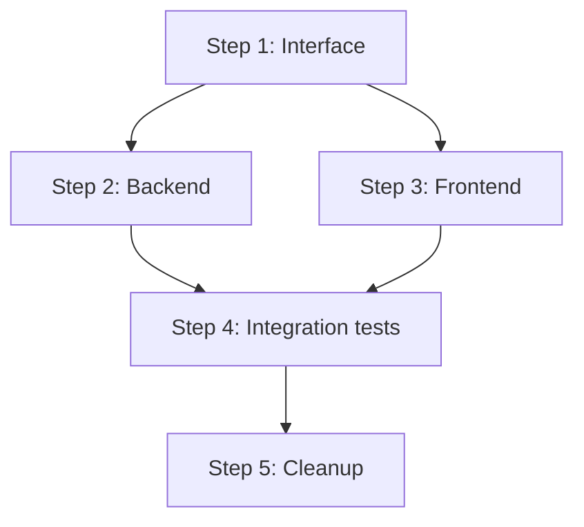

# Blueprint — Construction Plan Generator

Turn a one-line objective into a step-by-step construction plan that any coding agent can execute cold.


## When to Use

- Breaking a large feature into multiple PRs with clear dependency order
- Planning a refactor or migration that spans multiple sessions
- Coordinating parallel workstreams across sub-agents
- Any task where context loss between sessions would cause rework

**Do not use** for tasks completable in a single PR, fewer than 3 tool calls, or when the user says "just do it."

## How It Works

Blueprint runs a 5-phase pipeline:

1. **Research** — Pre-flight checks (git, gh auth, remote, default branch), then reads project structure, existing plans, and memory files to gather context.
2. **Design** — Breaks the objective into one-PR-sized steps (3-12 typical). Assigns dependency edges, parallel/serial ordering, model tier, and rollback strategy per step.
3. **Draft** — Writes a self-contained Markdown plan file. Every step includes a context brief, task list, verification commands, and exit criteria — so a fresh agent can execute any step without reading prior steps.
4. **Review** — Delegates adversarial review to a strongest-model sub-agent against a checklist and anti-pattern catalog. Fixes all critical findings before finalizing.
5. **Register** — Saves the plan, updates memory, and presents the step count and parallelism summary to the user.

## Output Format

Plans are saved to `plans/` (or docs repo if `workflow.json` exists):

```markdown
# Blueprint: {objective}

**Created:** {date}
**Steps:** {N} ({M} parallel groups)
**Estimated PRs:** {N}

## Dependency Graph



## Step 1: {title}

### Context Brief
{Everything a fresh agent needs to know to execute this step.
No reference to prior steps. Self-contained.}

### Tasks
- [ ] {task 1}
- [ ] {task 2}

### Verification
```bash
{commands to verify this step is done correctly}
```

### Exit Criteria
- {criterion 1}
- {criterion 2}

### Rollback
{How to undo this step if needed}

---

## Step 2: {title}
...
```

## Key Features

- **Cold-start execution** — every step includes a self-contained context brief
- **Adversarial review gate** — plan reviewed by a strongest-model sub-agent
- **Branch/PR workflow** — built into every step, degrades to direct mode without git/gh
- **Parallel step detection** — dependency graph identifies parallelizable work
- **Plan mutation** — steps can be split, inserted, skipped, reordered, or abandoned

## Examples

```
/dev-blueprint my-api "migrate from Dapper to EF Core"
/dev-blueprint my-app "add real-time notifications with SignalR"
/dev-blueprint my-frontend "extract shared UI components into a library"
```

## Anti-Pattern Catalog

Plans are reviewed against these anti-patterns:

| Anti-pattern | Detection |
|-------------|-----------|
| **Big bang step** | Any step touching >10 files |
| **Hidden dependency** | Step B reads file only modified in step A, but no edge exists |
| **Missing verification** | Step has no verification commands |
| **Context leak** | Step references "as we did in step N" instead of being self-contained |
| **No rollback** | Destructive step has no undo strategy |
| **Over-parallelism** | Parallel steps share files |
