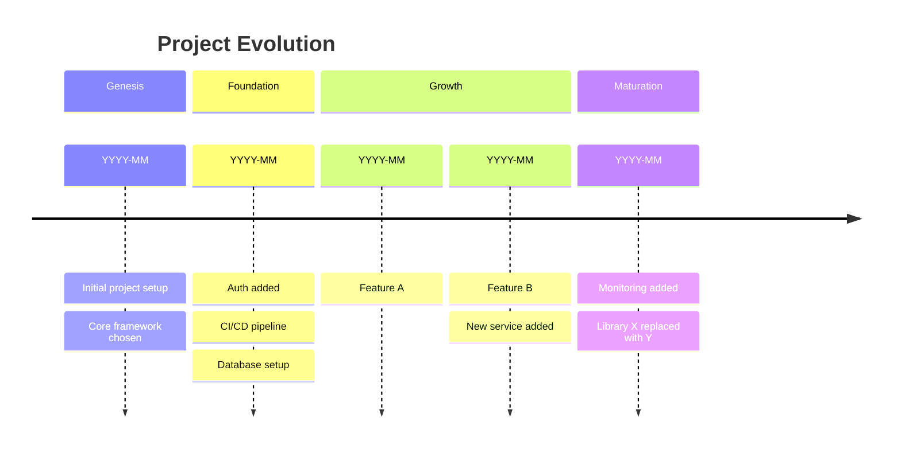

# Doc Init — Bootstrap Documentation from Existing Code

Analyze an existing codebase and generate a comprehensive documentation set as
**drafts for human review**. Every generated document is clearly marked as a draft.

> **Key principle:** Generated docs are starting points, not finished artifacts.
> The goal is 80% there so the developer only needs to review and refine,
> not write from scratch.

## Path Resolution

1. Read `workflow.json` in the project root
2. If it exists and `docsRepo` is `"."`: this IS the docs repo — output and templates use local paths
3. If it exists and `docsRepo` is a repo name: resolve via `pwsh .claude/skills/tool-worktree/scripts/resolve-repo.ps1 <docsRepo>` to get the docs root path. Output to `<resolved>/`, templates from `<resolved>/templates/`
4. If no `workflow.json`: output to `docs/`, templates from `templates/`

## Phase 1: Codebase Analysis (always runs first)

Before generating anything, build a mental model of the project.

### 1.1 Project Structure Scan

1. Read the project's top-level directory structure
2. Identify the tech stack:
   - Language/framework (package.json, *.csproj, go.mod, Cargo.toml, etc.)
   - Build system and tooling
   - Infrastructure files (Dockerfile, Bicep, Terraform, k8s manifests)
3. Read the main entry point files (Program.cs, main.ts, app.py, etc.)
4. Read existing CLAUDE.md, README.md, AGENTS.md for documented context
5. Note existing documentation (anything in docs/, guides/, adr/)

### 1.2 Dependency Analysis

6. Read dependency files (*.csproj PackageReferences, package.json, go.mod, etc.)
7. Identify key architectural dependencies:
   - Databases (EF Core, Prisma, SQLAlchemy, etc.)
   - Message queues (RabbitMQ, Kafka, Azure Service Bus)
   - External services (HTTP clients, SDKs)
   - Frameworks that imply architecture (event sourcing, CQRS, MediatR)
8. Map external system integrations

### 1.3 Architecture Discovery

9. Identify deployable units (containers, services, workers, jobs)
10. Identify data stores and their relationships
11. Map API surface:
    - REST endpoints (route definitions, controllers)
    - gRPC services
    - Message handlers / event consumers
12. Identify domain model:
    - Core entities / aggregates
    - Domain events
    - Value objects / specifications

### 1.4 Git Archaeology — Project Evolution Timeline

Reconstruct the project's history by mining git for architectural milestones,
dependency changes, structural shifts, and key decisions over time.

**13. Build the project timeline:**

Run these commands to gather raw history:

```bash
# First commit — project birth
git log --reverse --format="%ai %s" | head -1

# Full commit history with dates, condensed
git log --format="%ai %s" --all

# File creation timeline — when were key files/directories first added?
git log --diff-filter=A --format="%ai %H" --name-only -- \
  "*.csproj" "*.sln" "package.json" "go.mod" "Cargo.toml" \
  "Dockerfile" "docker-compose*" "*.bicep" "*.tf" \
  "*.proto" ".github/workflows/*" "infra/*"

# Dependency evolution — track package additions and removals over time
git log --all -p -- "*.csproj" "package.json" "go.mod" "requirements.txt" \
  | grep -E "^\+.*PackageReference|^\+.*\"dependencies\"|^\-.*PackageReference"

# Directory structure evolution — when did major directories appear?
git log --diff-filter=A --format="%ai" --name-only -- "*/" | head -200

# Contributors over time
git shortlog -sn --all
```

**14. Identify evolutionary phases:**

Group the timeline into phases based on what changed:

| Phase | Signals to look for |
|-------|-------------------|
| **Genesis** | First commit, initial project structure, core framework choices |
| **Foundation** | Database setup, auth added, CI/CD pipeline created |
| **Feature growth** | New domains/aggregates/endpoints added, dependency expansion |
| **Refactors** | Renamed directories, moved files, replaced libraries |
| **Infrastructure shifts** | New deployment targets, added monitoring, scaling changes |
| **Migrations** | Framework upgrades, database migrations, API versioning |

For each phase, note:
- **When** it happened (date range)
- **What** changed (key commits, files added/removed)
- **Why** it likely happened (infer from commit messages, PR titles)
- **Architectural impact** (did the system's shape change?)

**15. Detect specific architectural events:**

```bash
# When were new projects/services added? (new .csproj = new deployable unit)
git log --diff-filter=A --format="%ai %s" --name-only -- "*.csproj"

# When did infrastructure change? (Bicep, Terraform, Docker)
git log --format="%ai %s" -- "infra/*" "Dockerfile" "docker-compose*" "*.bicep" "*.tf"

# When were major libraries swapped? (removed + added in same commit range)
git log --all -p -- "*.csproj" | grep -E "^[\+\-].*PackageReference"

# When did the API surface change significantly?
git log --format="%ai %s" -- "**/Endpoints/**" "**/Controllers/**" "**/routes/**"

# When were test projects added?
git log --diff-filter=A --format="%ai %s" --name-only -- "*.Tests.csproj" "*.test.*" "jest.config*"

# When did monitoring/observability arrive?
git log --format="%ai %s" -- "**/dashboard*" "**/workbook*" "**/monitoring*" "appsettings*.json"
```

**16. Build the evolution summary:**

```
### Project Evolution Timeline

**Created:** YYYY-MM-DD
**Age:** N months
**Commits:** N total, N contributors

#### Phase 1: Genesis (YYYY-MM — YYYY-MM)
- Initial project setup with [framework]
- Core domain: [aggregates/entities created]
- Key decision: [e.g., chose event sourcing over traditional CRUD]

#### Phase 2: Foundation (YYYY-MM — YYYY-MM)
- Added [auth, database, CI/CD]
- Key decision: [e.g., Azure Container Apps over AKS]

#### Phase 3: Growth (YYYY-MM — YYYY-MM)
- Added [N] new features: [list]
- Introduced [workers, background jobs, etc.]
- Key decision: [e.g., added video processing pipeline]

#### Phase 4: Maturation (YYYY-MM — present)
- Refactored [what]
- Replaced [old] with [new]
- Added monitoring and observability

#### Inferred Architectural Decisions
| # | Decision | Detected from | Date | Confidence |
|---|---------|--------------|------|-----------|
| 1 | Use event sourcing | EventSourcing in .csproj | YYYY-MM | High |
| 2 | Azure Container Apps | Bicep modules | YYYY-MM | High |
| 3 | Replaced library X with Y | Package diff | YYYY-MM | Medium |
| 4 | Added video processing | New project + pipeline | YYYY-MM | High |
```

**17. Run `git shortlog -sn --all | head -10`** — who are the main contributors?

### 1.5 Present Analysis

18. Present a summary of findings to the user, including the evolution timeline:

```
### Codebase Analysis

**Project:** [name]
**Tech stack:** [languages, frameworks]
**Architecture:** [monolith/microservices/modular monolith]
**Deployable units:** [list]
**External systems:** [list]
**Data stores:** [list]
**Domain model:** [N aggregates, N events, etc.]
**History:** [created YYYY-MM, N commits, N contributors]

### Documentation Plan
Based on analysis, I'll generate:
- [ ] C4 System Context diagram (Level 1)
- [ ] C4 Container diagram (Level 2)
- [ ] C4 Component diagrams (Level 3) for [complex containers]
- [ ] Project evolution timeline
- [ ] ADRs for [N] inferred architectural decisions
- [ ] Domain model reference
- [ ] API endpoint reference
- [ ] Developer onboarding guide
- [ ] [Other docs based on what was found]

Estimated docs: [N] files
```

18. **Wait for user approval** before generating

## Phase 2: Architecture Diagrams

Generate C4 diagrams using the viz-c4-diagram skill's Mermaid syntax.

### 2.1 System Context (Level 1)

19. Generate the C4 Context diagram showing:
    - The system as a single box
    - All users/personas (infer from auth, roles, UI routes)
    - All external systems (from dependency analysis)
    - Relationship labels with protocols
20. Save to `<output>/architecture/system-context.md`

### 2.2 Container Diagram (Level 2)

21. Generate the C4 Container diagram showing:
    - Each deployable unit (API, frontend, workers, jobs)
    - Each data store
    - Message queues / event buses
    - Technology annotations on each container
22. Save to `<output>/architecture/containers.md`

### 2.3 Component Diagrams (Level 3)

23. For each complex container (typically the main API), generate a component diagram:
    - Endpoint groups / controllers
    - Domain services
    - Repositories / data access
    - Event handlers
    - External service clients
24. Save to `<output>/architecture/components-[container].md`

## Phase 3: Architecture Decision Records

Mine ADRs from the codebase and git history.

### 3.1 Infer Decisions

25. For each major architectural choice found, draft an ADR:

    **Always detectable:**
    - Primary language/framework choice
    - Database technology choice
    - Hosting platform (from infra files)
    - Authentication approach (from auth middleware/config)

    **Often detectable:**
    - Architecture pattern (event sourcing, CQRS, clean architecture)
    - API style (REST, gRPC, GraphQL)
    - Testing strategy (from test projects/frameworks)
    - CI/CD approach (from pipeline files)
    - Messaging/eventing choices

    **Sometimes detectable (from git history):**
    - Migration from one approach to another
    - Library replacements
    - Infrastructure changes

26. For each inferred ADR:
    - Read the template from `<templates>/adr.md`
    - Fill in context based on what was found in code
    - List the considered options as "inferred" (we can see what was chosen, but alternatives are educated guesses)
    - Mark status as `Inferred — needs review`
    - Number sequentially: `0001-[slug].md`
27. Save to `<output>/adr/`

### 3.2 ADR Quality Rules

- **Be honest about uncertainty:** "Based on the codebase, this appears to be the decision. The alternatives listed are inferred, not confirmed."
- **Don't invent rationale:** If you can't tell WHY a decision was made, say so. "Rationale unknown — confirm with the team."
- **Focus on significant decisions:** Don't create an ADR for every library choice. Only for architectural-level decisions.

## Phase 3b: Project Evolution Timeline

Save the evolution timeline from Phase 1.4 as a standalone document.

28. Generate `<output>/architecture/project-evolution.md` containing:
    - Project birth date and age
    - Phased timeline with dates, key changes, and architectural impact
    - Inferred decisions table with confidence levels
    - Dependency evolution (what was added, removed, replaced, and when)
    - Contributor summary
    - A Mermaid timeline diagram:



This document serves as the "story of the project" — useful for onboarding,
understanding why things are the way they are, and deciding what to change next.

## Phase 4: Domain Reference

28. Generate a domain model reference document:
    - List all aggregates/entities with their properties
    - List all domain events (grouped by aggregate)
    - List all specifications/validators
    - List all value objects / strongly typed IDs
    - Include a class diagram (Mermaid) for the domain model
29. Save to `<output>/reference/domain-model.md`

## Phase 5: API Reference

30. Generate an API endpoint reference:
    - Group endpoints by feature/resource
    - List method, route, auth requirements
    - Include request/response shapes if detectable
    - Note which endpoints are public vs. authenticated
31. Save to `<output>/reference/api-endpoints.md`

## Phase 6: Developer Onboarding

32. Generate a getting-started guide:
    - Prerequisites (SDKs, tools, runtimes)
    - How to clone and set up
    - How to run locally (infer from project files, docker-compose, etc.)
    - How to run tests
    - Project structure overview
    - Key conventions (from CLAUDE.md, code patterns)
33. Save to `<output>/guides/getting-started.md`

## Phase 7: Index & Summary

34. Create or update `<output>/index.md` with links to all generated docs
35. Create an ADR index at `<output>/adr/index.md`
36. Present the final summary:

```
### Documentation Init Complete

Generated [N] documents:

#### Architecture ([N] files)
- system-context.md — C4 Level 1
- containers.md — C4 Level 2
- components-api.md — C4 Level 3
- project-evolution.md — Timeline of how the project evolved

#### ADRs ([N] files)
- 0001-[decision].md
- 0002-[decision].md
- ...

#### Reference ([N] files)
- domain-model.md
- api-endpoints.md

#### Guides ([N] files)
- getting-started.md

### Review Required
All documents are marked as drafts. Review each one for:
- [ ] Accuracy — correct any wrong assumptions
- [ ] Completeness — add missing context you know
- [ ] ADR rationale — fill in "why" for inferred decisions
- [ ] Remove draft markers once reviewed
```

## Flags

| Flag | Behavior |
|------|----------|
| `--full` | Run all phases (default) |
| `--phase N` | Run only phase N (e.g., `--phase 2` for just architecture diagrams) |
| `--dry-run` | Run phase 1 analysis only, show what would be generated |
| `--skip-existing` | Don't regenerate docs that already exist |

## Draft Markers

Every generated document gets this banner at the top:

```markdown
> **DRAFT** — Auto-generated from codebase analysis on [date].
> Review for accuracy before removing this banner.
```

## Anti-Pattern Guards

- **Don't over-document the obvious**: Skip generating doc comments for self-explanatory code
- **Don't invent rationale**: If you can't determine WHY, mark it as "needs team input"
- **Don't generate once and forget**: This skill generates drafts; the doc-* skills maintain them
- **Don't skip the review step**: Always present the analysis (Phase 1) before generating
- **Don't duplicate existing docs**: Check for existing documentation first and note it
