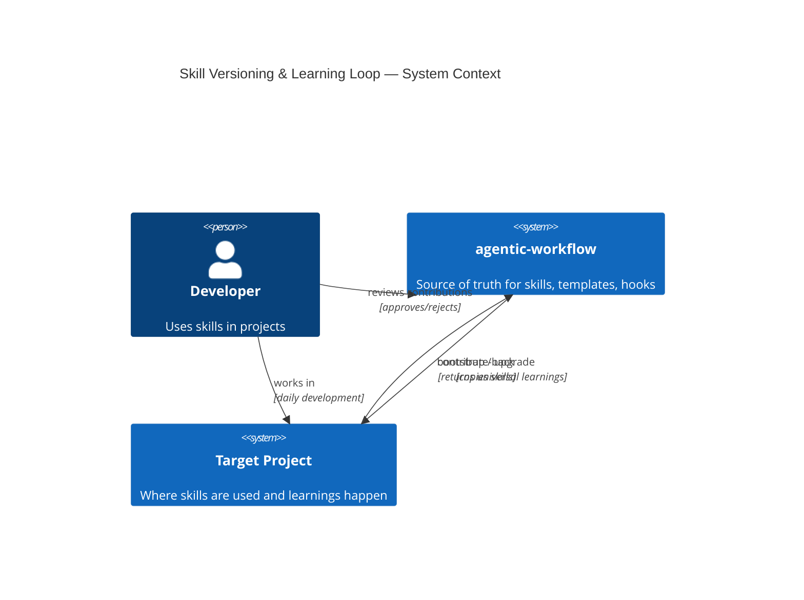
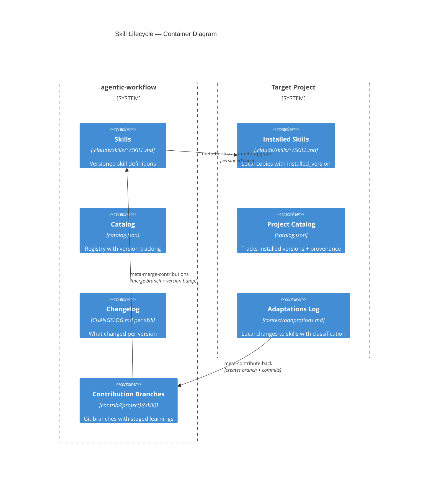
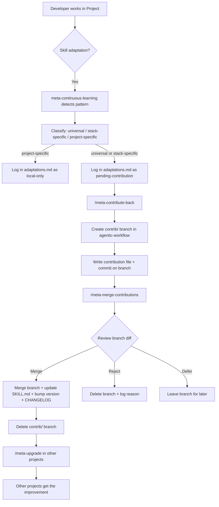

# Design Doc: Skill Versioning & Learning Feedback Loop

> **Status:** Implemented
> **Author:** Erik Lieben
> **Date:** 2026-03-16
> **Related ADRs:** None yet

## Overview

Agent-workflow has 31 skills installed across multiple projects via `meta-bootstrap` and `meta-upgrade`. Today there is no version tracking for skills, and learnings discovered while using a skill in a project have no path back to the source. This design adds versioning to skills and a structured feedback loop so improvements flow from project use back to the generic workflow and out to all other projects.

## Context

Three things have changed:

1. **Scale** — With 31 skills and growing, we need to know what version of a skill each project is running, and whether it's behind.
2. **Divergence** — Projects adapt skills locally (e.g., adding Aspire integration test handling to `dev-tdd-backend`). Some adaptations are project-specific, others are universally valuable. Today these improvements are trapped.
3. **Distribution gap** — There is no versioning or structured learning capture for skills today. We can do better by combining distribution awareness with our existing `meta-continuous-learning` skill.

## Goals and Non-Goals

### Goals

- Track skill versions in SKILL.md frontmatter and catalog.json
- Make `meta-upgrade` version-aware (show changelogs, detect breaking changes)
- Classify learnings as project-specific vs. universally applicable
- Provide a path to contribute universal learnings back to agentic-workflow
- Keep it simple — files and git, no external services

### Non-Goals

- Building a skill marketplace or registry service
- Supporting non-Claude agent harnesses (The Library's agent-agnostic goal)
- Automatic propagation without human review
- Dependency resolution between skills (separate concern, low current need)
- Per-project skill forking or branching (too complex for current scale)

## Detailed Design

### System Architecture





### Component Design

#### Component 1: Skill Versioning (SKILL.md + catalog.json)

- **Responsibility:** Track the version of each skill at source and in each project
- **Interface:** New `version` field in SKILL.md frontmatter; new `version` + `installed_version` fields in catalog.json
- **Implementation:**

**SKILL.md frontmatter gains a `version` field:**

```yaml
---
name: tdd-backend
version: 1.2.0
description: >
  TDD workflow for .NET...
disable-model-invocation: true
user-invocable: true
argument-hint: "[--red | --green | --refactor]"
---
```

Versioning scheme: `MAJOR.MINOR.PATCH`
- **PATCH** — Wording tweaks, typo fixes, clarifications. No behavior change.
- **MINOR** — New capabilities, additional steps, broader coverage. Backwards-compatible.
- **MAJOR** — Restructured workflow, removed steps, changed invocation interface. May require project adaptation.

**catalog.json gains version tracking:**

```json
{
  "name": "dev-tdd-backend",
  "category": "dev",
  "description": "...",
  "path": ".claude/skills/dev-tdd-backend",
  "invocation": "user-only",
  "added": "2026-03-16",
  "version": "1.2.0",
  "installed_from": "agentic-workflow",
  "installed_version": "1.2.0",
  "installed_date": "2026-03-16"
}
```

- `version` — current version at source (in agentic-workflow's catalog)
- `installed_version` — version that was installed in this project
- `installed_from` — provenance: "agentic-workflow" or "local"
- `installed_date` — when this version was installed

#### Component 2: Skill Changelog

- **Responsibility:** Human-readable history of what changed per skill version
- **Interface:** `CHANGELOG.md` file in each skill directory
- **Implementation:**

```markdown
# Changelog: dev-tdd-backend

## 1.2.0 — 2026-03-20
- Added Aspire integration test handling (contributed from my-project)
- Added TestContainers cleanup step

## 1.1.0 — 2026-03-16
- Added event sourcing test patterns for EventSourcing

## 1.0.0 — 2026-03-16
- Initial version: xUnit + NSubstitute TDD workflow
```

Changelogs live in agentic-workflow only (source of truth). Not copied to projects — they'd go stale. `meta-upgrade --diff` shows changelog entries between installed and current version.

#### Component 3: Adaptations Log (per-project)

- **Responsibility:** Track local modifications to skills with classification
- **Interface:** `context/adaptations.md` in each project
- **Implementation:**

When a skill is modified locally (detected by `meta-continuous-learning` or manually logged), an entry is added:

```markdown
# Skill Adaptations

## dev-tdd-backend (installed: 1.0.0)

### 2026-03-18 — Added Aspire integration test phase
- **Classification:** universal
- **What:** Added Phase 4 for Aspire integration tests using TestContainers
- **Why:** Standard xUnit TDD workflow missed integration test patterns needed for Aspire service-to-service testing
- **Diff summary:** Added 25 lines to SKILL.md between "## Phase 3: Refactor" and "## Anti-patterns"
- **Status:** pending-contribution

### 2026-03-19 — Added custom event store test helper
- **Classification:** project-specific
- **What:** Added reference to my-project's EventStoreTestFixture
- **Why:** Project-specific test infrastructure, not portable
- **Status:** local-only
```

**Classification values:**
- `universal` — Applicable to any project using this skill's stack. Candidate for contribution.
- `stack-specific` — Applicable to projects with the same stack but might need adaptation. Candidate for contribution with caveat.
- `project-specific` — Only relevant to this project. Stays local.

**Status values:**
- `pending-contribution` — Classified as universal/stack-specific, not yet contributed
- `contributed` — Submitted to agentic-workflow contributions inbox
- `merged` — Accepted and merged into source skill (with version bump)
- `rejected` — Reviewed and intentionally kept out of source
- `local-only` — Project-specific, no contribution planned

#### Component 4: Contributions Inbox (agentic-workflow)

- **Responsibility:** Staging area for learnings coming back from projects
- **Interface:** `contributions/` directory in agentic-workflow root
- **Implementation:**

```
contributions/
  dev-tdd-backend/
    2026-03-18-aspire-integration-tests.md
  dev-security-backend/
    2026-03-20-rate-limiting-pattern.md
```

Each contribution file:

```markdown
# Contribution: Aspire Integration Test Phase

- **Skill:** dev-tdd-backend
- **From project:** my-project
- **Date:** 2026-03-18
- **Classification:** universal
- **Installed version:** 1.0.0

## What changed

Added Phase 4 for Aspire integration tests using TestContainers.
Standard xUnit TDD workflow missed integration test patterns needed
for Aspire service-to-service testing.

## Proposed diff

[Actual content to add/change in SKILL.md — not a git diff, but the
readable section to insert or modify]

## Context

[Why this came up, what problem it solved, any edge cases discovered]
```

Contributions are reviewed by the developer before merging. This is intentional — automated merging would erode skill quality.

#### Component 5: Enhanced meta-upgrade (version-aware)

- **Responsibility:** Show version gaps, changelogs, and handle upgrades with awareness of local adaptations
- **Interface:** Existing `/meta-upgrade` with enhanced output
- **Implementation changes:**

Current flow: compare files → show diff → apply. New flow:

1. **Read project catalog** — get `installed_version` for each skill
2. **Read source catalog** — get current `version` for each skill
3. **Compare versions** — categorize:
   - `up-to-date` — same version
   - `patch-available` — safe to auto-apply
   - `minor-available` — new features, review recommended
   - `major-available` — breaking changes, review required
   - `ahead-of-source` — project has modifications (check adaptations.md)
4. **Show upgrade report** with changelog entries between installed and current
5. **Check adaptations.md** — warn if upgrading a skill that has local adaptations
6. **Apply** — update files, bump `installed_version` and `installed_date` in project catalog

```
Skill Upgrade Report
━━━━━━━━━━━━━━━━━━━
Skill                    Installed  Current  Status
dev-tdd-backend          1.0.0      1.2.0    minor-available (2 changes)
dev-security-backend     1.0.0      1.0.1    patch-available
meta-heartbeat           1.1.0      1.1.0    up-to-date
dev-verification-backend 1.0.0      2.0.0    major-available ⚠
  └─ BREAKING: Verification phases restructured

⚠ dev-tdd-backend has 1 local adaptation (Aspire integration tests)
  Run /meta-contribute-back dev-tdd-backend before upgrading to preserve changes.
```

#### Component 6: meta-contribute-back (new skill)

- **Responsibility:** Package universal learnings from a project and send them to agentic-workflow's contributions inbox via a git branch
- **Interface:** `/meta-contribute-back [skill-name | --all]`
- **Implementation:**

Workflow:

1. **Read adaptations.md** — find entries with status `pending-contribution` (or filter by skill name)
2. **For each pending adaptation:**
   a. Read the local skill's SKILL.md
   b. Diff against the source skill (from agentic-workflow)
   c. Extract only the universal/stack-specific changes
   d. Generate a contribution file
3. **Locate agentic-workflow repo** — read `workflow.json` → `workflowRepo`, resolve path via `pwsh .claude/skills/tool-worktree/scripts/resolve-repo.ps1 <workflowRepo>`
4. **Create a contribution branch** in agentic-workflow:
   - Branch name: `contrib/{project-name}/{skill-name}` (e.g., `contrib/my-project/dev-tdd-backend`)
   - If the branch already exists (prior contribution to same skill from same project), switch to it and rebase on main
5. **Write contribution files** to `contributions/{skill-name}/` on the branch
6. **Commit** with message: `contrib: {skill-name} from {project-name} — {short description}`
7. **Update adaptations.md** in the source project — set status to `contributed`
8. **Log to daily memory**
9. **Report** — show the branch name and suggest next step: `/meta-merge-contributions` in agentic-workflow

The branch-per-contribution model gives the developer a clean review path:
- `git log main..contrib/{project}/{skill}` shows exactly what's proposed
- Multiple contributions to the same skill from the same project accumulate on one branch
- Contributions from different projects stay isolated on separate branches
- Merging is a standard git merge — familiar workflow, full history preserved

#### Component 7: meta-merge-contributions (new skill, agentic-workflow only)

- **Responsibility:** Review and merge contribution branches into main, applying version bumps
- **Interface:** `/meta-merge-contributions [--skill name | --all | --list]`
- **Implementation:**

Workflow:

1. **List contribution branches** — `git branch --list 'contrib/*'`, group by skill
2. **For each branch** (or filtered by `--skill`):
   a. Show `git log main..contrib/{project}/{skill}` — what's proposed
   b. Read the contribution file(s) on the branch
   c. Read the current skill SKILL.md on main
   d. Present the proposed change with context and diff
   e. Ask: merge / reject / defer?
3. **On merge:**
   a. Merge the contribution branch into main (fast-forward or merge commit)
   b. Apply the proposed changes from the contribution file to the actual SKILL.md
   c. Determine version bump (patch/minor based on change scope)
   d. Update CHANGELOG.md with entry
   e. Update version in SKILL.md frontmatter
   f. Update version in catalog.json
   g. Remove the contribution file (the learning is now in the skill itself)
   h. Commit: `feat({skill-name}): {description} [from {project}]`
   i. Delete the contribution branch
   j. Log to daily memory
4. **On reject:**
   a. Delete the contribution branch
   b. Optionally log rejection reason in daily memory
5. **On defer:**
   a. Leave the branch as-is for later review

### Data Flow



### Error Handling

| Error Case | Detection | Response | Recovery |
|---|---|---|---|
| Skill has no version field | `meta-upgrade` reads frontmatter | Treat as `0.0.0`, suggest adding version | Run version seeding script |
| agentic-workflow repo not found | `resolve-repo` script fails | Ask user for path | Store in workflow.json |
| Contribution conflicts with recent changes | Merge finds overlapping sections | Show both versions, ask user | Manual merge |
| Local adaptations would be lost on upgrade | `meta-upgrade` checks adaptations.md | Warn + suggest contribute-back first | Contribute or acknowledge loss |
| Adaptations.md doesn't exist | contribute-back reads file | Create it with header | Auto-create on first adaptation |

## Alternatives Considered

### Alternative 1: Git-based versioning (use commit hashes)

Track skill versions by git commit hash instead of semver. `meta-upgrade` would compare hashes and show `git log` between them.

**Rejected because:** Commit hashes are opaque — you can't tell if a change is breaking without reading it. Semver communicates intent. Also, skills don't map 1:1 to commits (a commit might touch multiple skills).

### Alternative 2: The Library's push model (direct file sync)

Adopt The Library's approach: `push` copies the local file back to source, `sync` re-pulls. No structured contribution review.

**Rejected because:** Direct push without classification would pollute the source with project-specific adaptations. The learning loop needs a filter step — not everything learned in one project belongs in the generic skill. The contributions inbox with human review is that filter.

### Alternative 3: Automatic propagation via hooks

A hook detects skill modifications and automatically contributes them back.

**Rejected because:** Most skill edits during a session are experimental. Auto-contributing would flood the inbox with noise. The explicit `/meta-contribute-back` invocation ensures only intentional, reviewed adaptations flow upstream.

## Cross-Cutting Concerns

### Security

- Contributions inbox is in agentic-workflow, which is a private repo — no exposure risk
- `adaptations.md` is in `context/` which is gitignored by default — personal adaptations don't leak
- No credentials or tokens involved — everything is local file operations + git

### Observability

- Daily memory logs all version upgrades and contributions
- `meta-upgrade --diff` shows full audit trail
- CHANGELOG.md per skill provides human-readable history
- `meta-skill-catalog` audit command extended to report version mismatches

### Scalability

- Current scale: 31 skills, 2-3 projects. This design handles up to ~100 skills and ~20 projects comfortably.
- Beyond that: contributions inbox might need subdirectories by project, and catalog.json might need tooling to query. Not a concern today.

## Test Plan

### Verification Scenarios

- Bootstrap a project, verify `installed_version` and `installed_from` populated in catalog.json
- Bump a skill version in agentic-workflow, run `meta-upgrade` in project, verify changelog shown and version updated
- Modify a skill locally, run `meta-continuous-learning`, verify adaptation logged with classification
- Run `/meta-contribute-back`, verify contribution file created in agentic-workflow
- Run `/meta-merge-contributions`, verify skill updated, version bumped, changelog appended
- Upgrade a skill that has local adaptations — verify warning shown
- Run `meta-skill-catalog` audit — verify version mismatch detection

### Edge Cases

- Skill with no version field (pre-versioning) — should default to `0.0.0`
- Multiple contributions to the same skill from different projects — should coexist in inbox
- Contributing back when agentic-workflow repo path is unknown — should prompt for path
- Upgrading when adaptations.md has `pending-contribution` entries — should warn

## Implementation Plan

| Phase | Description | Skills Touched |
|---|---|---|
| 1 — Version seeding | Add `version: 1.0.0` to all 31 SKILL.md frontmatters. Add `version`, `installed_version`, `installed_from`, `installed_date` to catalog.json schema. Create empty CHANGELOG.md in each skill dir. | All SKILL.md files, catalog.json |
| 2 — Upgrade awareness | Enhance `meta-upgrade` to read versions, compare semver, show changelogs, warn about local adaptations. | meta-upgrade |
| 3 — Adaptations tracking | Add adaptation detection to `meta-continuous-learning`. Create `context/adaptations.md` format. Add classification prompts. | meta-continuous-learning |
| 4 — Contribute-back | Create `meta-contribute-back` skill. Create `contributions/` directory structure in agentic-workflow. | New skill |
| 5 — Merge contributions | Create `meta-merge-contributions` skill (agentic-workflow only). Wire up version bumping and changelog updates. | New skill |
| 6 — Bootstrap integration | Update `meta-bootstrap` to populate version fields. Update `meta-adopt-skill` to set initial version. | meta-bootstrap, meta-adopt-skill |

### Dependencies

- Phase 2 depends on Phase 1 (need versions to compare)
- Phase 4 depends on Phase 3 (need adaptations to contribute)
- Phase 5 depends on Phase 4 (need contributions to merge)
- Phase 6 can run in parallel with Phases 3-5

## Open Questions

- [x] ~~Should CHANGELOG.md be copied to projects?~~ **Decided: no.** `meta-upgrade --diff` shows changelogs on demand. Avoids staleness.
- [x] ~~Should `meta-contribute-back` create a git branch + commit in agentic-workflow, or just write files?~~ **Decided: git branch.** Branch name `contrib/{project}/{skill}`. Gives clean review via `git log`, familiar merge workflow, and full history. Multiple contributions to the same skill from the same project accumulate on one branch.
- [x] ~~Should version bumps be a single commit per skill, or batched?~~ **Decided: single commit per skill.** Cleaner history, easier to revert.

## References

- `meta-continuous-learning` SKILL.md — Existing pattern extraction system
- `meta-upgrade` SKILL.md — Existing upgrade mechanism
- `meta-bootstrap` SKILL.md — Existing project installation
