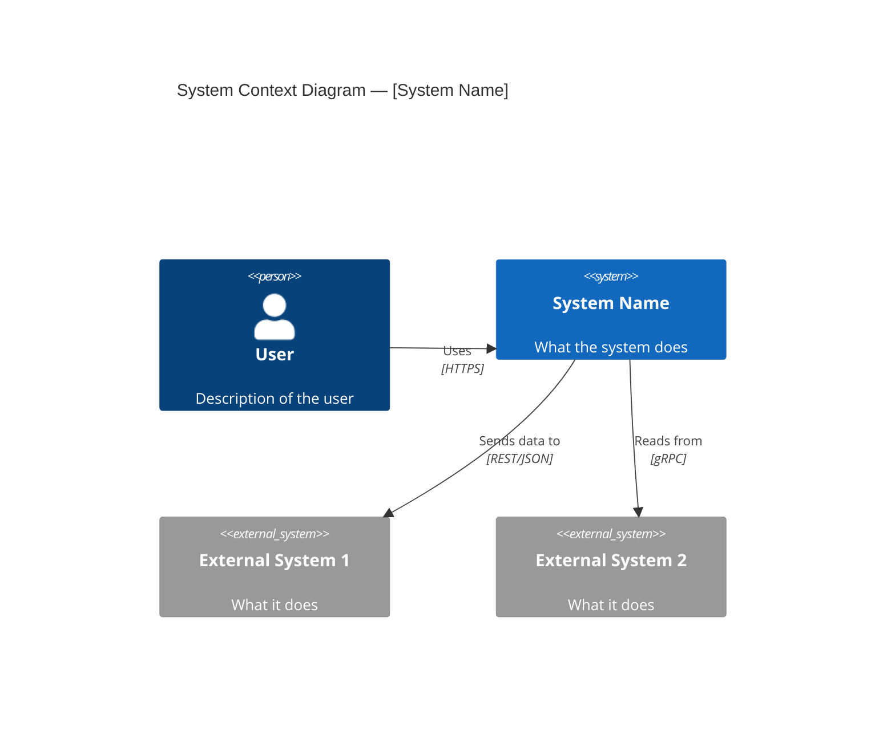
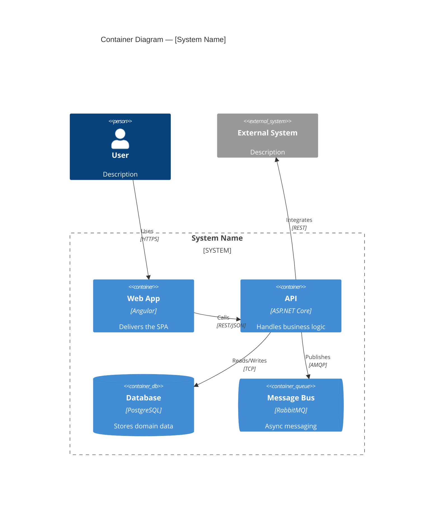
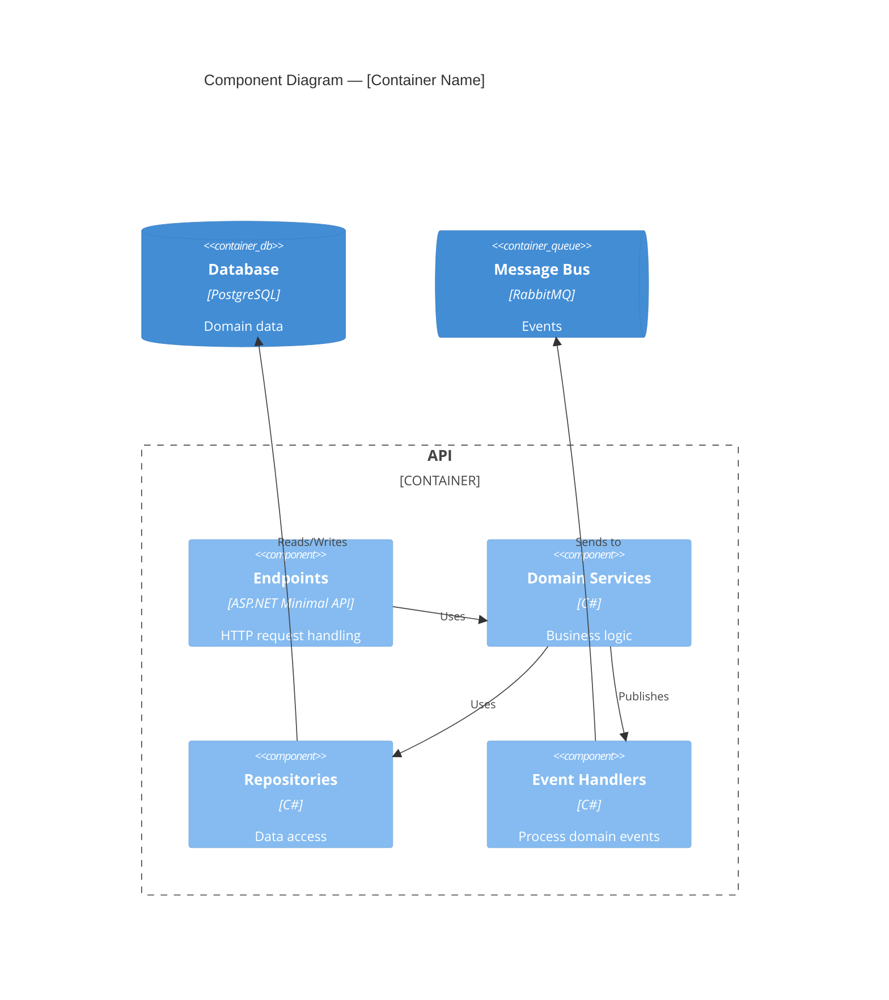
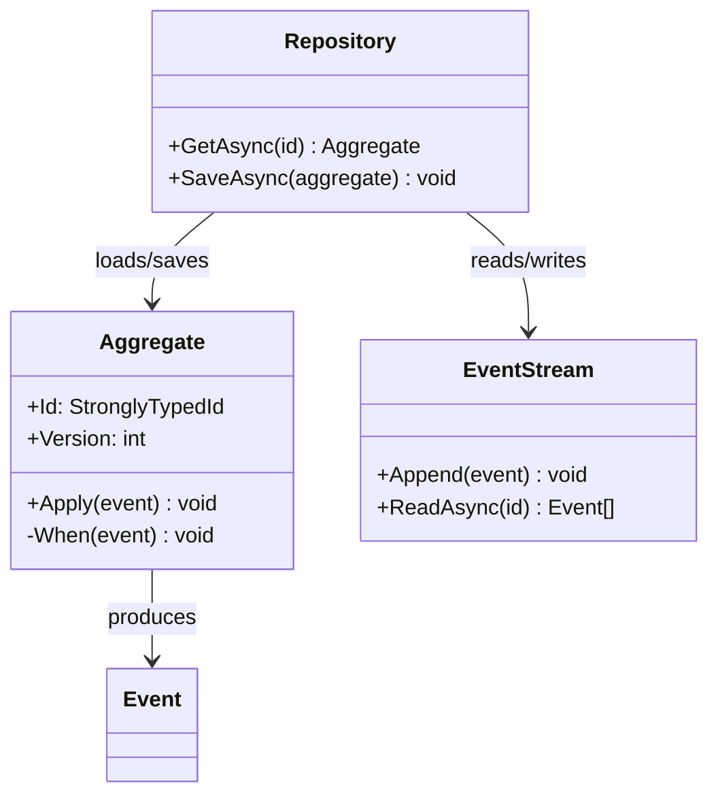
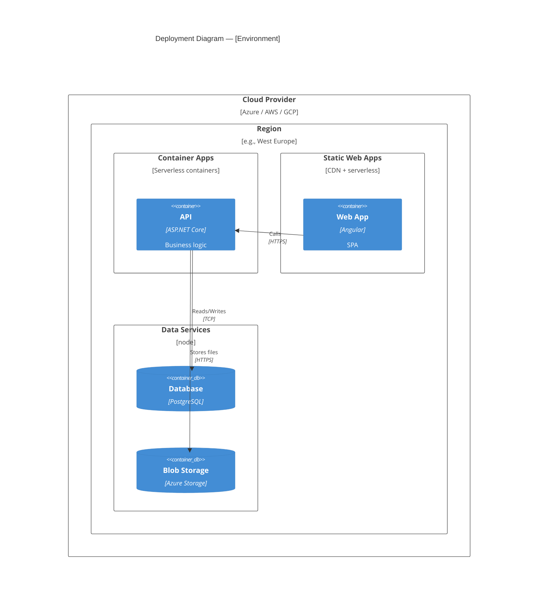

# C4 Diagrams: [System Name]

> **Date:** [YYYY-MM-DD]
> **Author:** [Name]
> **System:** [System being documented]

## Level 1: System Context

Who uses the system and what other systems does it interact with?

## Level 2: Container

What are the high-level technical building blocks?

## Level 3: Component

What are the key components inside a container?

## Level 4: Code (optional)

Key class relationships within a component. Use standard class diagrams.

## Deployment (optional)

## Notes

- Diagrams should be updated when architecture changes
- Level 4 (Code) diagrams are optional — only create for complex components
- Use consistent color coding: internal = blue, external = grey, database = green
