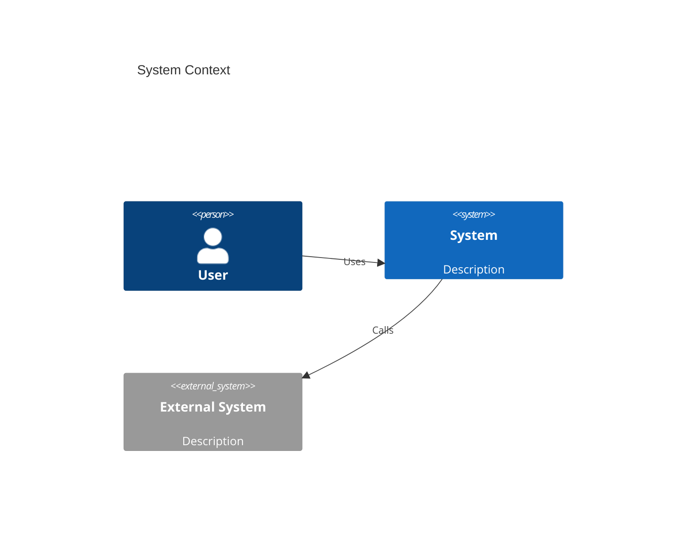

# Design Doc: [Title]

> **Status:** Draft | In Review | Approved | Implemented | Deprecated
> **Author:** [Name]
> **Reviewers:** [Names]
> **Date:** [YYYY-MM-DD]
> **Related PRD:** [Link]
> **Related ADRs:** [Links]

## Overview

One paragraph context: what system or feature is this about, and what problem does it solve?

## Context

What is the background? What has changed that makes this design necessary?

## Goals and Non-Goals

### Goals

- [What this design achieves]

### Non-Goals

- [What this design explicitly does NOT address]

## Detailed Design

### System Architecture

Describe the high-level architecture. Reference C4 diagrams:



### Component Design

Describe each component in detail.

#### Component A

- **Responsibility:** [What it does]
- **Interface:** [How other components interact with it]
- **Implementation:** [Key implementation details]

#### Component B

- **Responsibility:** [What it does]
- **Interface:** [How other components interact with it]
- **Implementation:** [Key implementation details]

### Data Design

#### Schema

```
[Schema definitions]
```

#### Data Flow

How does data move through the system?

### API Design

```
[Endpoint definitions, request/response examples]
```

### Error Handling

| Error Case | Detection | Response | Recovery |
|-----------|----------|---------|----------|
| | | | |

## Alternatives Considered

### Alternative 1: [Name]

[Description and why it was rejected]

### Alternative 2: [Name]

[Description and why it was rejected]

## Cross-Cutting Concerns

### Security

- Authentication: [approach]
- Authorization: [approach]
- Data protection: [approach]

### Observability

- Logging: [what gets logged]
- Metrics: [what gets measured]
- Tracing: [distributed tracing approach]
- Alerting: [what triggers alerts]

### Scalability

- Current expected load: [numbers]
- Design limits: [where this design breaks]
- Scaling strategy: [horizontal/vertical, sharding, etc.]

### Reliability

- SLA target: [e.g., 99.9%]
- Failure modes: [what can go wrong]
- Recovery: [how the system recovers]

## Test Plan

### Unit Tests

- [Key behaviors to test]

### Integration Tests

- [Component interaction scenarios]

### End-to-End Tests

- [Critical user journeys]

### Load Tests

- [Performance benchmarks and acceptance criteria]

## Implementation Plan

| Phase | Description | Estimated Effort |
|-------|------------|-----------------|
| 1 | | |
| 2 | | |
| 3 | | |

### Dependencies

- [External dependencies and their timeline]

### Rollout Strategy

- [ ] Feature flag setup
- [ ] Canary deployment
- [ ] Gradual rollout
- [ ] Full deployment

## Open Questions

- [ ] [Unresolved design question]

## References

- [Related documents, papers, prior art]
